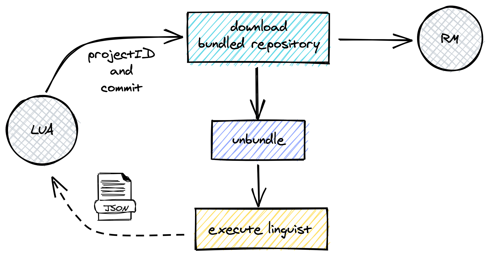
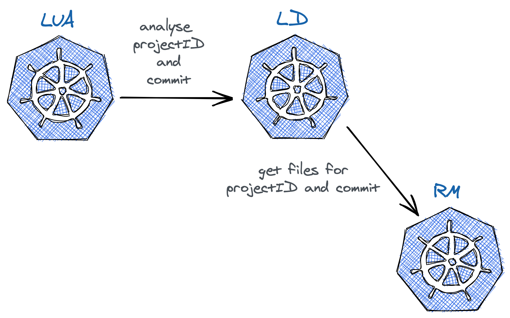

# LD - Language Detector

This tool is using [github-linguist](https://github.com/github/linguist) under the hood. It provides information about the languages used withing a project.

The result is returned in the following format:

```json
[
    {
        "name": "Java",
        "files": [
            "/src/main/com.example/A.java"
            "/src/main/com.example/B.java"
            "/src/main/com.example/utils/C.java"
        ]
    },
    {
        "name": "Python",
        "files": [
            "setup.py",
            "abc/cde/run.py"
        ]
    }
]
```

## How it works?



## Integrations

